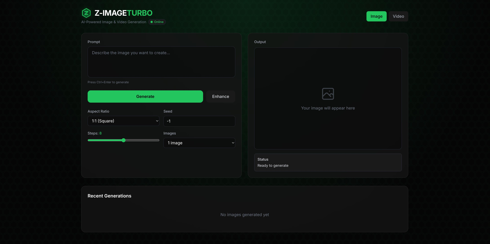
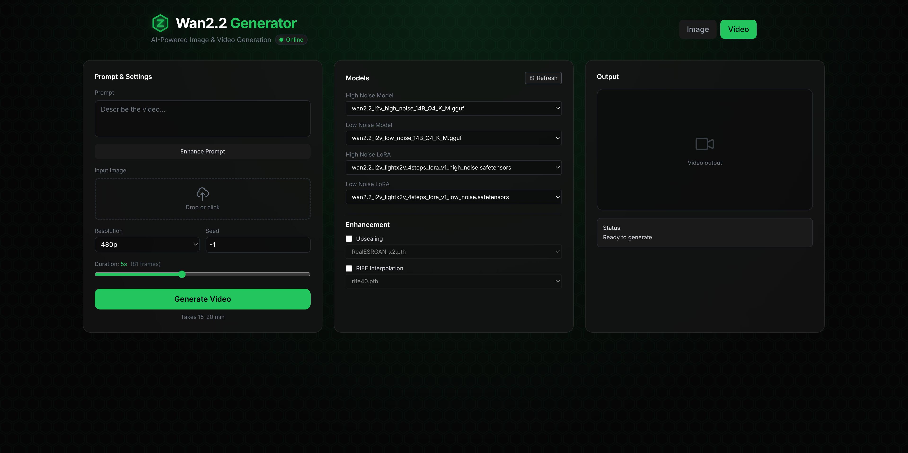

# Z-Image-Turbo & WAN 2.2 Video Local Deployment

A Dockerized AI image and video generation system running [Z-Image-Turbo](https://huggingface.co/Tongyi-MAI/Z-Image-Turbo) and [WAN 2.2](https://github.com/Wan-Video/Wan2.1) locally on consumer hardware (RTX 3060 12GB).


### Image Generation


### Video Generation


## Features

### Image Generation (Z-Image-Turbo)

- **Fast Generation**: ~3 seconds per image with 8-step distilled model
- **AI Prompt Enhancement**: Optional LLM-powered prompt expansion using Qwen2.5-7B (runs on CPU, non-blocking)
- **Advanced Controls**: Adjustable steps (4-12), multiple aspect ratios
- **Image History**: Gallery of last 12 generated images

### Video Generation (WAN 2.2)

- **Image-to-Video (I2V)**: Animate Z-Image generated images into videos
- **AI Prompt Enhancement**: Cinematography-focused prompt expansion optimized for WAN 2.2 (camera movements, lighting, motion)
- **4-Step Lightning LoRAs**: Fast generation with distilled models
- **VRAM Optimized**: wanBlockSwap enables 14B parameter models on 12GB VRAM
- **User Model Selection**: Choose any downloaded model from dropdown menus
- **AI Upscaling**: Up to 4x resolution using RealESRGAN
- **Frame Interpolation (RIFE)**: Smooth 2x/4x framerate enhancement for fluid motion

### General

- **Local Deployment**: Complete privacy, runs entirely on your hardware
- **User-Friendly UI**: Modern web UI with Tailwind CSS + Alpine.js
- **GGUF Quantization**: Optimized to fit in 12GB VRAM
- **One-Click Download**: Save images/videos with metadata filenames

## Architecture

```
┌─────────────────────────────────────────────────────────┐
│  Frontend (FastAPI + Tailwind CSS)                      │
│  Port: 7860                                             │
│  - Tabbed UI (Image / Video)                            │
│  - WebSocket client for progress tracking               │
│  - Prompt Enhancement (Qwen2.5-7B on CPU)               │
└─────────────────────┬───────────────────────────────────┘
                      │ HTTP + WebSocket
┌─────────────────────▼───────────────────────────────────┐
│  Backend (ComfyUI)                                      │
│  Port: 8188                                             │
│  - Headless inference engine                            │
│  - GGUF model support via ComfyUI-GGUF                  │
│  - Video support via VideoHelperSuite, wanBlockSwap     │
│  - CUDA 12.1 + PyTorch + ffmpeg                         │
└─────────────────────┬───────────────────────────────────┘
                      │
┌─────────────────────▼───────────────────────────────────┐
│  Models                                                 │
│  Image:                                                 │
│  - Z-Image-Turbo Q8_0 (7.2GB)                           │
│  - Qwen 3 4B Text Encoder IQ4_XS (2.3GB)                │
│  - Flux VAE (335MB)                                     │
│  Video:                                                 │
│  - WAN 2.2 I2V GGUF models (8-9GB each)                 │
│  - UMT5 XXL Text Encoder FP8 (6.7GB)                    │
│  - WAN 2.1 VAE (254MB)                                  │
│  - Lightning LoRAs for 4-step generation                │
│  - RealESRGAN Upscalers                                 │
│  - RIFE Interpolation Models                            │
└─────────────────────────────────────────────────────────┘
```

## Requirements

### Hardware

- **GPU**: NVIDIA RTX 3060 12GB (or similar with 12GB+ VRAM)
- **RAM**: 16GB minimum (32GB recommended)
- **Storage**: 15GB+ for image generation, 60GB+ for full video support
- **OS**: Linux (tested on Linux Mint 21.3 / Ubuntu 22.04) or Windows with WSL2 (see [WSL2 Setup Guide](docs/setup-guides/Windows-WSL2.md))

### Software

- Docker Engine (v24.0+)
- Docker Compose (v2.20+)
- NVIDIA Driver 550+ (CUDA 12.1 compatible)
- NVIDIA Container Toolkit

## Installation

### 1. Install NVIDIA Drivers

```bash
# Check current driver
nvidia-smi

# If needed, install driver 550+
sudo apt install nvidia-driver-550
sudo reboot
```

### 2. Install Docker

```bash
# Add Docker's official GPG key
sudo apt-get update
sudo apt-get install ca-certificates curl gnupg
sudo install -m 0755 -d /etc/apt/keyrings
curl -fsSL https://download.docker.com/linux/ubuntu/gpg | sudo gpg --dearmor -o /etc/apt/keyrings/docker.gpg
sudo chmod a+r /etc/apt/keyrings/docker.gpg

# Add repository
echo \
  "deb [arch=$(dpkg --print-architecture) signed-by=/etc/apt/keyrings/docker.gpg] https://download.docker.com/linux/ubuntu \
  jammy stable" | sudo tee /etc/apt/sources.list.d/docker.list > /dev/null

# Install Docker
sudo apt-get update
sudo apt-get install docker-ce docker-ce-cli containerd.io docker-buildx-plugin docker-compose-plugin
```

### 3. Install NVIDIA Container Toolkit

```bash
curl -fsSL https://nvidia.github.io/libnvidia-container/gpgkey | sudo gpg --dearmor -o /usr/share/keyrings/nvidia-container-toolkit-keyring.gpg \
  && curl -s -L https://nvidia.github.io/libnvidia-container/stable/deb/nvidia-container-toolkit.list | \
  sed 's#deb https://#deb [signed-by=/usr/share/keyrings/nvidia-container-toolkit-keyring.gpg] https://#g' | \
  sudo tee /etc/apt/sources.list.d/nvidia-container-toolkit.list

sudo apt-get update
sudo apt-get install -y nvidia-container-toolkit
sudo nvidia-ctk runtime configure --runtime=docker
sudo systemctl restart docker
```

### 4. Clone Repository

```bash
git clone https://github.com/binkiewka/z-image-turbo-local.git
cd z-image-turbo-local
```

### 5. Download Models

Create model directories and download the required files:

```bash
# Create model directories
mkdir -p models/diffusion_models models/text_encoders models/vae models/loras models/upscaler models/vfi
```

#### Image Generation Models (Required)

```bash
# Z-Image-Turbo diffusion model (7.2GB)
wget -O models/diffusion_models/z_image_turbo-Q8_0.gguf \
  "https://huggingface.co/jayn7/Z-Image-Turbo-GGUF/resolve/main/z_image_turbo-Q8_0.gguf"

# Qwen 3 4B text encoder (2.3GB)
wget -O models/text_encoders/Qwen_3_4b-IQ4_XS.gguf \
  "https://huggingface.co/worstplayer/Z-Image_Qwen_3_4b_text_encoder_GGUF/resolve/main/Qwen_3_4b-IQ4_XS.gguf"
```

**Flux VAE (335MB) - Manual Download Required:**

1. Visit [black-forest-labs/FLUX.1-schnell](https://huggingface.co/black-forest-labs/FLUX.1-schnell)
2. Log in to HuggingFace and click "Agree and access repository"
3. Download [ae.safetensors](https://huggingface.co/black-forest-labs/FLUX.1-schnell/blob/main/ae.safetensors)
4. Move it: `mv ~/Downloads/ae.safetensors models/vae/`

#### Video Generation Models (Optional)

For WAN 2.2 Image-to-Video generation, download from [QuantStack/Wan2.2-I2V-A14B-GGUF](https://huggingface.co/QuantStack/Wan2.2-I2V-A14B-GGUF):

```bash
# I2V Models (Image-to-Video) - Pick Q4_K_M or Q4_K_S
wget -O models/diffusion_models/Wan2.2-I2V-A14B-HighNoise-Q4_K_M.gguf \
  "https://huggingface.co/QuantStack/Wan2.2-I2V-A14B-GGUF/resolve/main/HighNoise/Wan2.2-I2V-A14B-HighNoise-Q4_K_M.gguf"
wget -O models/diffusion_models/Wan2.2-I2V-A14B-LowNoise-Q4_K_M.gguf \
  "https://huggingface.co/QuantStack/Wan2.2-I2V-A14B-GGUF/resolve/main/LowNoise/Wan2.2-I2V-A14B-LowNoise-Q4_K_M.gguf"

# UMT5 Text Encoder (6.7GB)
wget -O models/text_encoders/umt5_xxl_fp8_e4m3fn_scaled.safetensors \
  "https://huggingface.co/Comfy-Org/Wan_2.1_ComfyUI_repackaged/resolve/main/split_files/text_encoders/umt5_xxl_fp8_e4m3fn_scaled.safetensors"

# WAN VAE (254MB)
wget -O models/vae/wan_2.1_vae.safetensors \
  "https://huggingface.co/Comfy-Org/Wan_2.1_ComfyUI_repackaged/resolve/main/split_files/vae/wan_2.1_vae.safetensors"

# Lightning LoRAs for 4-step I2V generation
wget -O models/loras/wan2.2_i2v_lightx2v_4steps_lora_v1_high_noise.safetensors \
  "https://huggingface.co/Comfy-Org/Wan_2.2_ComfyUI_Repackaged/resolve/main/split_files/loras/wan2.2_i2v_lightx2v_4steps_lora_v1_high_noise.safetensors"
wget -O models/loras/wan2.2_i2v_lightx2v_4steps_lora_v1_low_noise.safetensors \
  "https://huggingface.co/Comfy-Org/Wan_2.2_ComfyUI_Repackaged/resolve/main/split_files/loras/wan2.2_i2v_lightx2v_4steps_lora_v1_low_noise.safetensors"

#### Improvement Models (Optional)

```bash
# RealESRGAN x2 Upscaler
wget -O models/upscaler/RealESRGAN_x2.pth \
  "https://huggingface.co/ai-forever/Real-ESRGAN/resolve/main/RealESRGAN_x2.pth"

# RIFE v4.9 for Frame Interpolation
wget -O models/vfi/rife49.pth \
  "https://huggingface.co/hfmaster/models-moved/resolve/main/rife/rife49.pth"
```

```

**Verify downloads (important!):**

```bash
ls -lh models/diffusion_models/  # Should show ~7.2GB (image) + ~9.65GB each (video)
ls -lh models/text_encoders/      # Should show ~2.3GB + ~6.7GB
ls -lh models/vae/                 # Should show ~335MB + ~254MB
ls -lh models/loras/               # Should show ~1.23GB each
```

> ⚠️ If any file shows **0 bytes**, delete it and re-download. This is a common issue that causes startup failures.

### 6. Build and Run

```bash
# Build containers
docker compose build --no-cache

# Start services
docker compose up -d

# View logs
docker compose logs -f
```

## Platform Support

This project officially supports:

- **Linux** (Ubuntu 22.04, Linux Mint 21.3, or similar): Follow the [Installation](#installation) section above
- **Windows with WSL2**: Follow the comprehensive [Windows WSL2 Setup Guide](docs/setup-guides/Windows-WSL2.md)
  - Includes step-by-step WSL2 installation
  - NVIDIA GPU passthrough configuration
  - Docker setup (both Docker CE and Docker Desktop options)
  - WSL2-specific troubleshooting and performance optimization

## Usage

### Image Generation

1. **Access the UI**: Open `http://localhost:7860` in your browser
2. **Select the Image Tab**: Click "🖼️ Image Generation"
3. **Enter a prompt**: Describe the image you want (e.g., "a cat wearing a wizard hat")
4. **Optional settings**:
   - **Seed**: Use -1 for random, or a specific number for reproducibility
   - **Steps**: 4-12 (default 8) - more steps = better quality but slower
   - **Aspect Ratio**: Choose from 1:1, 3:4, 4:3, 16:9, 9:16
5. **Generate or Enhance**:
   - Click **🎨 Generate** to create an image immediately
   - Click **✨ Enhance** to get an AI-expanded version of your prompt (~5-10s)
6. **Download**: Click the download link to save the image

### Video Generation (Image-to-Video)

1. **Generate a source image**: First create an image using the Image tab
2. **Select the Video Tab**: Click "🎬 Video Generation (WAN 2.2)"
3. **Click "🔄 Refresh Model List"**: Populates dropdowns with available models
4. **Upload your source image**: Drag and drop or click to upload the Z-Image generated image
5. **Select Models**:
   - **High Noise Model**: First pass model (e.g., `Wan2.2-I2V-A14B-HighNoise-Q4_K_M.gguf`)
   - **Low Noise Model**: Second pass model (e.g., `Wan2.2-I2V-A14B-LowNoise-Q4_K_M.gguf`)
   - **LoRAs**: Select matching Lightning LoRAs for 4-step generation
6. **Enter prompt**: Describe the motion/animation you want
7. **Optional - Enhance Prompt**: Click **Enhance Prompt** to expand your simple prompt into a cinematic description with camera movements, lighting, and motion details optimized for WAN 2.2
8. **Settings**:
   - **Resolution**: 480p recommended for 12GB VRAM
   - **Frames**: 81 frames = ~5 seconds at 16fps
9. **Post-Processing (Optional)**:
   - **Upscaling**: Enable to double resolution (e.g., 480p -> 960p)
   - **Interpolation**: Enable RIFE for smoother motion (e.g., 16fps -> 32fps)
10. **Click "🎬 Generate Video"**: Takes ~15-20 minutes

> **Note**: Video generation requires both High Noise and Low Noise models with matching LoRAs. The two-pass approach (high noise → low noise) produces better quality.

## Configuration

### Ports

- **Frontend**: `7860` (Web UI)
- **Backend**: `8188` (ComfyUI API)

To change ports, edit `docker-compose.yml`:

```yaml
ports:
  - "0.0.0.0:7860:7860"  # Change first 7860 to desired port
```

### VRAM Management

The system uses ~11.4GB VRAM with default settings. If you experience OOM errors:

1. **Reduce resolution**: Use lower aspect ratios (720p instead of 1024p)
2. **Use fewer steps**: Try 4-6 steps instead of 8
3. **Use lighter text encoder**: Download `Qwen_3_4b-Q3_K_M.gguf` (2GB instead of 2.3GB)

## Troubleshooting

### "CUDA Out of Memory"

- **Cause**: Resolution too high or other GPU processes running
- **Fix**: Close other GPU apps, use lower resolution, reduce steps to 4-6

### "Models not loading"

- **Cause**: Model files not downloaded or in wrong folder
- **Fix**: Verify files exist in `models/diffusion_models/`, `models/text_encoders/`, `models/vae/`

### "WebSocket connection failed"

- **Cause**: Backend still starting up
- **Fix**: Wait 30-60 seconds, check logs with `docker compose logs backend`

### "Generation is slow (30s+)"

- **Cause**: Models loading from disk on each request
- **Fix**: After first generation, subsequent ones should be ~3s. If not, check if GPU is being used:

  ```bash
  docker exec z-image-backend nvidia-smi
  ```

### "Invalid prompt validation error"

- **Cause**: Model files not found or incompatible versions
- **Fix**: Verify exact filenames match:
  - `z_image_turbo-Q8_0.gguf`
  - `Qwen_3_4b-IQ4_XS.gguf`
  - `ae.safetensors`

### Video: "Model dropdowns are empty"

- **Cause**: Models not detected or backend not ready
- **Fix**:
  1. Wait for backend to fully start (check `docker compose logs comfyui`)
  2. Click "🔄 Refresh Model List" button
  3. Verify I2V model files are in `models/diffusion_models/` with "i2v" in the filename

### Video: "Generation timed out (20 min)"

- **Cause**: GPU too slow or model too large
- **Fix**:
  1. Use Q4_K_S models instead of Q4_K_M (smaller, faster)
  2. Reduce frame count to 49
  3. Use 480p resolution only

### Video: "CUDA Out of Memory" during video

- **Cause**: 720p resolution or too many frames
- **Fix**:
  1. Use 480p (848x480) resolution only
  2. Reduce frames to 49-81
  3. Close other GPU applications

## Development

### Rebuild after changes

```bash
# Rebuild everything
docker compose down -v && docker compose build --no-cache && docker compose up

# Rebuild only frontend
docker compose build --no-cache frontend && docker compose up -d

# Rebuild only backend
docker compose build --no-cache comfyui && docker compose up -d
```

### View logs

```bash
docker compose logs -f           # All services
docker compose logs -f frontend  # Frontend only
docker compose logs -f comfyui   # Backend only
```

## Performance

### Image Generation

| Metric | Value |
|--------|-------|
| First generation | ~10-30s (model loading) |
| Subsequent generations | ~3s |
| VRAM usage | ~11.4GB / 12GB |
| Resolution | Up to 1024x1024 |
| Steps | 4-12 (default 8) |

### Video Generation

| Metric | Value |
|--------|-------|
| Generation time | ~15-20 minutes |
| VRAM usage | ~10-11GB (with wanBlockSwap) |
| Resolution | 848x480 (480p) |
| Duration | ~5 seconds (81 frames @ 16fps) |
| Output format | MP4 (H.264) |
| Steps | 4 (with Lightning LoRA) |

## Credits

### Image Generation

- **Z-Image-Turbo**: [Tongyi-MAI/Alibaba](https://huggingface.co/Tongyi-MAI/Z-Image-Turbo)
- **Flux VAE**: [Black Forest Labs](https://huggingface.co/black-forest-labs/FLUX.1-schnell)
- **Qwen 3**: [Qwen Team](https://github.com/QwenLM/Qwen)

### Video Generation

- **WAN 2.2**: [Wan-Video](https://github.com/Wan-Video/Wan2.1)
- **WAN 2.2 GGUF**: [city96](https://huggingface.co/city96/wan2.2-i2v-14B-gguf)
- **Lightning LoRAs**: [Kijai](https://huggingface.co/Kijai/WanVideo_comfy)
- **wanBlockSwap**: [city96](https://github.com/city96/wanBlockSwap)
- **VideoHelperSuite**: [Kosinkadink](https://github.com/Kosinkadink/ComfyUI-VideoHelperSuite)

### Infrastructure

- **ComfyUI**: [comfyanonymous](https://github.com/comfyanonymous/ComfyUI)
- **ComfyUI-GGUF**: [city96](https://github.com/city96/ComfyUI-GGUF)

## License

This project is for personal use. Model licenses:

- Z-Image-Turbo: Apache 2.0
- FLUX.1-schnell: Apache 2.0
- ComfyUI: GPL-3.0

## Support

For issues or questions:

1. Check [Troubleshooting](#troubleshooting) section
2. Review Docker logs: `docker compose logs -f`
3. Verify GPU access: `docker exec z-image-backend nvidia-smi`
